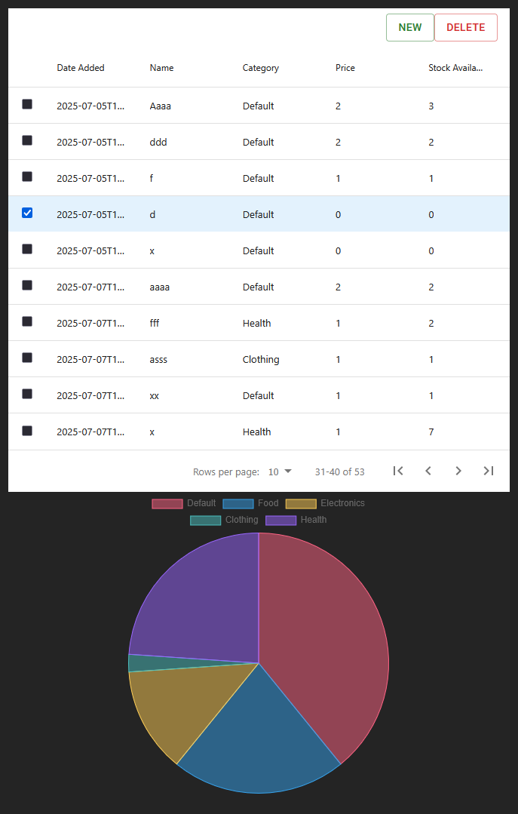

# Product Management Dashboard

A simple full-stack application for managing products with a RESTful API backend and React frontend.

## 📋 Overview

This application provides a product management system with the following features:

- ✅ RESTful API for product CRUD operations
- ⚛️ React frontend with data table and visualization
- 💾 Embedded database storage using LiteDB
- 📊 Product categorization and inventory tracking

## 🛠️ Tech Stack

### Backend
- **Framework**: ASP.NET Core (C#)
- **Database**: LiteDB (embedded NoSQL database)
- **Architecture**: Repository & service pattern

### Frontend
- **Framework**: React with Vite
- **Testing**: Vitest/React Testing Library
- **Features**: Data table with sorting/filtering, charts for data visualization

## 🚀 Setup Instructions

### Prerequisites
- `.NET 8.0 SDK`
- `Node.js` (version 16 or later)
- `npm`

### Backend Setup

1. Navigate to the PMDashboard.Api directory:
   ```bash
   cd PMDashboard.Api
   ```

2. Restore dependencies:
   ```bash
   dotnet restore
   ```

3. Run the backend server:
   ```bash
   dotnet run
   ```

> The API will be available at `http://localhost:5059`.

### Frontend Setup

1. Navigate to the frontend directory:
   ```bash
   cd PMDashboard/frontend
   ```

2. Install dependencies:
   ```bash
   npm install
   ```

3. Start the development server:
   ```bash
   npm run dev
   ```

> The frontend will be available at `http://localhost:5173` (default Vite port).

### 🧪 Running Tests

#### Backend Tests
```bash
cd PMDashboard.Api
dotnet test
```

#### Frontend Tests
```bash
cd PMDashboard/frontend
npm test
```

## 📚 API Documentation

### Base URL
```
http://localhost:5059/api
```

### 🛠️ Endpoints

#### Get All Products
- **`GET`** `/Product/GetAll`
- **Description**: Retrieve a list of all products
- **Response**: Array of product objects

#### Get Product by ID
- **`POST`** `/Product/Get`
- **Description**: Retrieve a specific product by ID
- **Response**: Product object

#### Create Product
- **`POST`** `/Product/Create`
- **Description**: Register a new product
- **Request Body**:
  ```json
  {
    "name": "Product Name",
    "category": 1,
    "price": 99.99,
    "stockQuantity": 50,
    "dateAdded": "2024-01-15T10:30:00Z"
  }
  ```
- **Response**: Created product object

#### Delete Product
- **`POST`** `/Product/Delete`
- **Description**: Delete a product by ID
- **Response**: Deleted ID

### 📦 Product Model

```json
{
  "id": "int",
  "name": "string",
  "category": "string",
  "price": "number",
  "stockQuantity": "number",
  "dateAdded": "datetime"
}
```

### 🏷️ Category Types Enum

```json
{
  Default = 0
  Food
  Electronics
  Clothing
  Health
}
```

### 🏷️ Categories
Supported product categories:
- 📦 Default
- 🍔 Food
- 📱 Electronics
- 👕 Clothing
- 📚 Health

## 🖥️ Frontend Features

### 📊 Data Table
- **Display**: Shows all products in a tabular format
- **Sorting**: Click column headers to sort by any field
- **Filtering**: Search functionality for Product Code and Name

### 📈 Visualization
- **Stock by Category Chart**: Pie chart showing total stock quantity per category

## 💾 Database

The application uses **LiteDB**, an embedded NoSQL database that stores data in a local file. The database is automatically initialized when the application starts, and no additional setup is required.

### 🔧 Database Features
- ✅ **File-based storage**: Data persists in a local `.db` file
- ⚡ **No installation required**: LiteDB is embedded within the application

## 🧪 Testing

### Backend Tests
- ✅ A mix of unit and integration tests
- ⛔ Separate test suites

### Frontend Tests
- ✅ API and context integration tests
- ⛔ User interaction tests
- ⛔ Component rendering tests


## 💢 Todo
### Frontend
- More tests. Further split out individual components from e.g. from CreateModalComponent and test functionality in conjunction of ProductProvider. 
- Edit and delete product modals
- Selector to change graph type
- Update styling

### Backend
- More tests, and seperate test suites
- Capability for deliveries